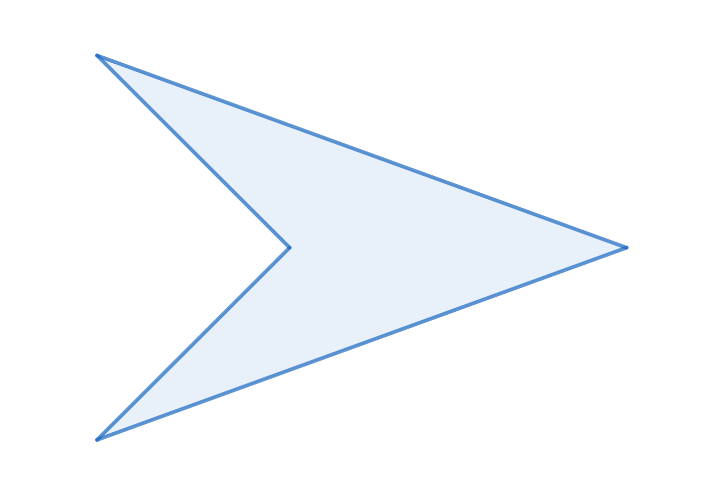

# Simulazione del comportamento di stormi
**Autore:** Dario Eugenio Campisi

- [Descrizione generale](#descrizione-generale)
- [Implementazioni aggiuntive](#implementazioni-aggiuntive)
- [Istruzioni per la compilazione](#istruzioni-per-la-compilazione)

## Descrizione generale
Il progetto è un tentativo di implementazione del programma **Boids**, sviluppato da Craig Reynolds nel 1986, che fa uso della libreria grafica **SFML**. L'obiettivo del programma è quello di simulare il comportamento di un generico "stormo" (e.g. di uccelli), costituito da singole entità che rispettano delle precise "regole di volo", i *boid*, qui rappresentati da una forma simil-triangolare.

### Regole di volo
Il movimento di ogni *boid* facente parte di uno stormo è il risultato delle seguenti semplici regole:
- **Separazione:**
- **Allineamento:**
- **Coesione:**

Ogni regola viene applicata solo ai boid considerati **vicini**.

Da esse, un numero elevato di *boid* fa emergere dei **comportamenti macroscopici caotici**, che approssimano il comportamento degli stormi reali.

### Comportamento ai bordi
Quando un *boid* comincia ad avvicinarsi ad uno dei bordi della finestra questo vira in modo da evitarla. Per ottenere questo effetto è stato definito un **margine** nei pressi dei bordi della finestra, quando il *boid* lo supera, la sua velocità viene gradualmente invertita secondo un opportuno **fattore di virata**.

## Implementazioni aggiuntive
#### Più stormi
All'inizio di ogni simulazione, è equiprobabile la generazione di uno, due o tre stormi, differenziati dal colore. Il movimento di un *boid* è quindi unicamente influenzato dai "compagni di stormo" vicini.

#### Predatore
È stata aggiunta la presenza costante di un predatore, si differenzia dagli altri boid per colore e dimensioni. Esso rispetta la regola della **coesione**, i boid a lui vicini invece avvertono una cosiddetta **repulsione**, regola analoga alla **separazione** ma di maggiore intensità.

#### Left-click per far comparire un *boid*
Oltre ai *boid* presenti all'inizio della simulazione, generati con posizioni, orientazioni e velocità casuali, è possibile aggiungerne degli altri tramite un mouse left-click, che genererà un *boid* appartenente ad uno stormo casuale.

### Top bar
Nella top bar viene mostrato il calcolo degli fps in tempo reale. Sono inoltre presenti degli *slider*, grazie ai quali è possibile regolare alcuni parametri delle regole di volo, in modo da osservare i cambiamenti degli stormi e comprenderne appieno il significato.

### Angolo di vista
Per rendere la simulazione più realistica, i boid non tengono conto dei compagni che "non vedono", che sono cioè al di fuori del loro **angolo di vista**.

### Gestione del fuori focus
Quando la finestra va fuori focus la simulazione va in pausa e lo schermo viene leggermente scurito, quando la finestra torna in focus la simulazione riparte.

## Istruzioni per la compilazione