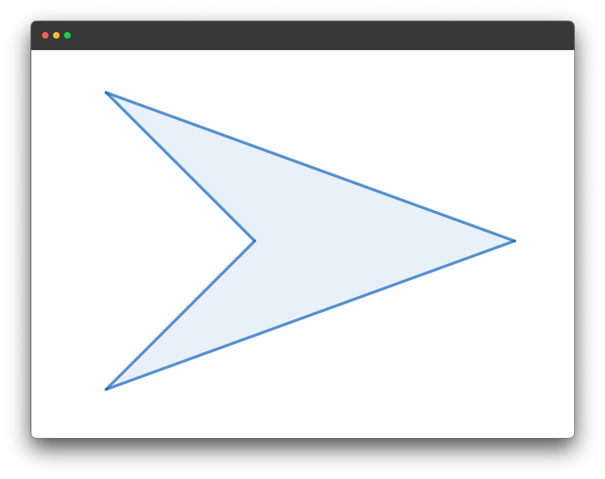
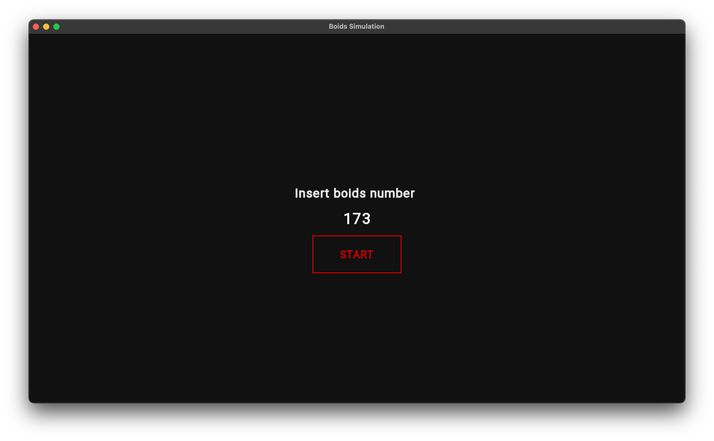
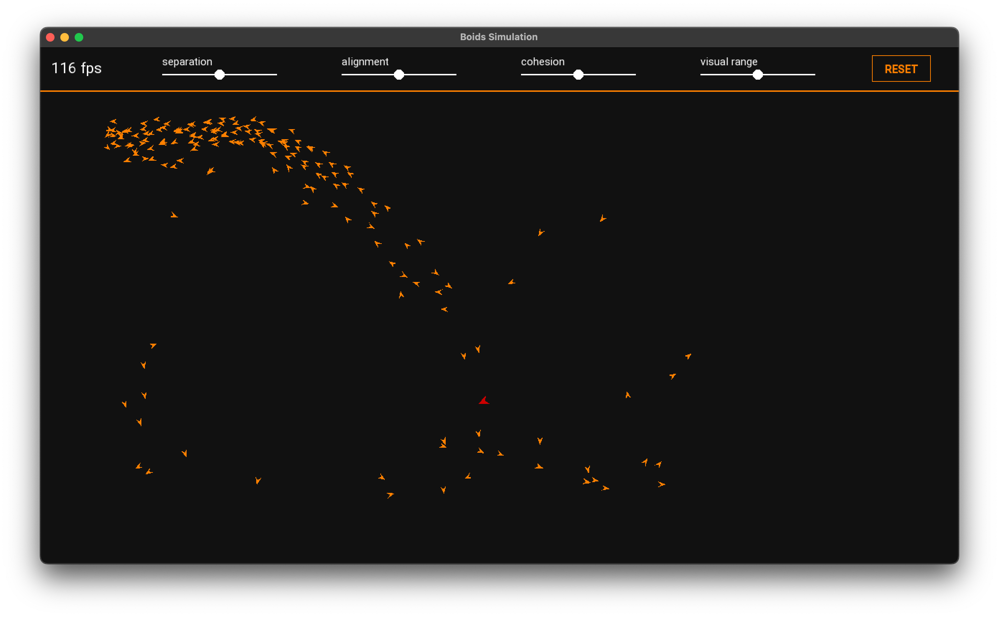
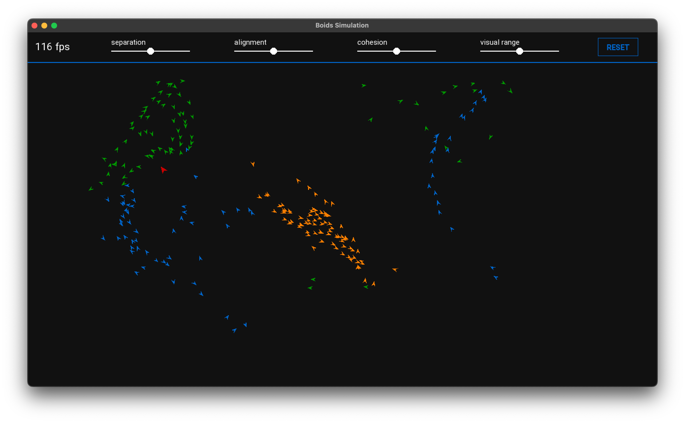

# Simulazione del comportamento di stormi
**Autore:** Dario Eugenio Campisi

- [Descrizione generale](#descrizione-generale)
- [Logica di implementazione](#logica-di-implementazione)
- [Altre implementazioni aggiuntive](#implementazioni-aggiuntive)
- [Istruzioni per la compilazione](#istruzioni-per-la-compilazione)

## Descrizione generale
Il progetto è un tentativo di implementazione del programma **Boids**, sviluppato da Craig Reynolds nel 1986, facente uso della libreria grafica **SFML**. L'obiettivo del programma è quello di simulare il comportamento di un generico **stormo** (e.g. di uccelli), ovvero un sistema complesso costituito da singole entità, i *boid*, che rispettano delle precise regole di movimento, qui chiamate **regole di volo**.

<div align="center">


<b>Figura 1:</b> Forma geometrica usata per la rappresentazione grafica dei boid
</div>

### Regole di volo
Il movimento nel piano di ogni boid è il risultato delle seguenti regole. In modo da favorire la formazione di più stormi indipendenti, esse vengono applicate unicamente ai boid considerati **vicini**, quelli cioè la cui distanza non supera un certo valore.

- **Separazione:** induce i boid a mantenere tra loro una certa distanza, impedendogli così di sovrapporsi
- **Allineamento:** fa sì che i boid seguano la stessa direzione dei vicini
- **Coesione:** spinge i boid a muoversi verso il centro di massa dello stormo

Da queste tre semplici regole emergono dei **comportamenti macroscopici caotici**, del tutto simili a quelli degli stormi reali.

### Comportamento ai bordi
Quando un boid comincia ad avvicinarsi ad uno dei quattro bordi della finestra, questo vira in modo da evitarlo. Per ottenere questo effetto è stato definito un **margine** nei pressi dei bordi, se superato la velocità del boid viene gradualmente invertita secondo un opportuno **fattore di virata**.

### Dinamica della simulazione
All'avvio del programma viene mostrata una **schermata iniziale** che invita l'utente a scegliere il numero di boid che saranno generati (limitato ad un massimo di 300 per garantire delle buone prestazioni):

<div align="center">


<b>Figura 2:</b> Schermata iniziale
</div>

Per dare inizio alla simulazione l'utente può utilizzare il pulsante *start* o alternativamente premere *enter*.

Durante la simulazione è possibile regolare il valore dei parametri delle regole di volo e del raggio di visione dei boid tramite degli **slider**, osservando in tempo reale come tali modifiche si riflettono sui movimenti macroscopici degli stormi. Per tornare rapidamente ai valori impostati di default, è sufficiente premere il pulsante *reset*.

<div align="center">


<b>Figura 3:</b> Frame di una simulazione con un solo stormo arancione costituito da 173 boid
</div>


Come è possibile notare dalla **Figura 3**, alle simulazioni è stata aggiunta la presenza costante di un **predatore**, differenziato dai boid per colore e dimensioni. Il suo ruolo è quello di inseguire gli stormi inducendo ai boid vicini una spinta di **repulsione**.

### Componente stocastica
In ogni simulazione è equiprobabile la generazione di uno, due o tre **stormi diversi**, differenziati per colore. I possibili colori degli stormi e dei dettagli grafici della *top bar* sono <span style="color:rgb(0, 102, 204)">blu</span>, <span style="color:rgb(0, 153, 0)">verde</span> e <span style="color:rgb(255, 128, 0)">arancione</span>.


<div align="center">


<b>Figura 4:</b> Frame di una simulazione con 230 boid divisi in tre stormi diversi
</div>

### Gestione dell'output §
Ogni 3.000 iterazioni del game loop (poco meno di 30 secondi) vengono stampati a schermo distanza e velocità media dei boid con relative deviazioni standard

È possibile attivare/disattivare l'output su console nella schermata iniziale, se attivata si consiglia di non generare troppi boid

## Logica di implementazione
Lo scheletro del programma è costituito da tre classi: **Boid**, **Slider** e **Button**, tutte fortemente basate sulle classi fornite dalla libreria **SFML/Graphics**.

### Boid
È la classe fondamentale del programma, permette la rappresentazione e il movimento dei boid nella finestra. Internamente è costituita da una ``` sf::ConvexShape```, definita in modo da ottenere la forma mostrata in **Figura 1**, e da un ```sf::Vector2f``` rappresentante la velocità del boid.

La classe possiede inoltre vari **metodi**, di seguito si riportano quelli principali:

- ```Boid(const sf::Color &color, const sf::Vector2f &position, const sf::Vector2f &velocity)``` 
    
    ```Boid(const sf::Vector2f &position, const sf::Vector2f &velocity)```

    Sono i due costruttori della classe, il primo viene usato per istanziare i boid, mentre il secondo per istanziare il predatore;

- ```bool isCloseAndVisible(const Boid &other, const float d, const float angle_view) const```

    Verifica che i boid siano all'interno del campo visivo del boid su cui è applicato, così da applicare correttamente le regole di volo;

- ```void maxVelocity(const float max_velocity)```

    Esegue un controllo sulla velocità del boid, se questa supera il valore impostato per la velocità massima, viene riportata al valore limite;

- ```void avoidBoundary(const float window_width, const float window_height, const float turn_factor, const float margin)```

    Impone il [comportamento ai bordi](#comportamento-ai-bordi) di cui sopra;

- ```bool isFlockMate(const Boid &other) const```

    Verifica che i boid siano compagni di stormo del boid su cui è applicato, la verifica consiste banalmente nel controllo dei colori dei due boid;

### Slider
È la classe utilizzata per la creazione e il funzionamento degli slider a cui si è accennato in [dinamica della simulazione](#dinamica-della-simulazione). Internamente è costituita da: una ```sf::RectangleShape``` che rappresenta la barra di scorrimento dello slider, una ```sf::CircleShape``` rappresentante invece il cursore, un ```sf::Text``` per mostrare il titolo, una ```float&``` per legare lo slider ad un certo parametro e un ```const float``` per il valore di default del parametro.

**Metodi principali**:

- ```bool mouseIsOver(const sf::RenderWindow &window) const```

    Verifica che il mouse sia sopra allo slider, condizione fondamentale affinchè il cursore possa essere mosso;

- ```void stayInRange()```

    Impedisce al cursore di muoversi oltre gli estremi della barra di scorrimento;

- ```void work(const sf::RenderWindow &window, const bool mouse_pressed)```

    Racchiude tutto il funzionamento dello slider, compresa la regolazione del parametro a cui lo slider è legato;

- ```void reset()```

    Riporta il cursore al centro della barra ed il parametro al suo valore di default, viene eseguito in seguito alla pressione del pulsante *reset* mostrato in **Figura 3**;

### Button
È una classe piuttosto semplice utilizzata per l'implementazione dei pulsanti *start* e *reset* visti in [dinamica della simulazione](#dinamica-della-simulazione), il cui funzionamento richiede però un forte utilizzo di ```sf::Event```. Internamente è costituita da una ```sf::RectangleShape``` che dà la forma al pulsante e da un ```sf::Text``` che ne rappresenta il titolo.

**Metodi principali**:

- ```bool mouseIsOver(const sf::RenderWindow &window) const```
    
    Metodo analogo a ```Slider::mouseIsOver```;

## Altre implementazioni aggiuntive
### Left-click per far comparire un boid
Oltre ai boid presenti all'inizio della simulazione, generati con posizioni, orientazioni e velocità casuali, è possibile aggiungerne degli altri tramite un mouse left-click, che genererà un boid appartenente ad uno stormo casuale.

### Angolo di vista
Per rendere la simulazione più realistica, i boid non tengono conto dei compagni che "non vedono", che sono cioè al di fuori del loro **angolo di vista**.

### Gestione del fuori focus
Quando la finestra va fuori focus la simulazione va in pausa e lo schermo viene leggermente scurito, quando la finestra torna in focus la simulazione riparte.

## Istruzioni per la compilazione